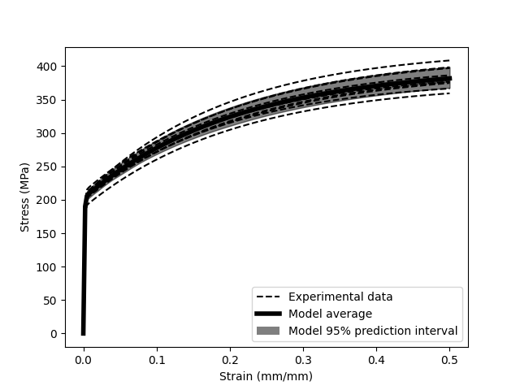

# pyoptmat: statistical inference for material models 

 

pyoptmat is a package for calibrating statistical material
models to data.  The package is based on [pytorch](https://pytorch.org/)
and [pyro](https://pyro.ai/) and provides a framework for using machine-learning
techniques to calibrate deterministic and statistical models against
experimental data.

A “material model” is mathematically a parameterized system of ordinary 
differential equations which, integrated through the experimental conditions, 
returns some simulated output that can be compared to the test measurements.
pyoptmat uses Bayesian inference with the pyro package to find statistical
distributions of the model  parameters to explain the variation in the 
experimental data.

As an example, consider a collection of tension test data on several samples 
of a material. The test measurements have some variation caused by 
manufacturing variability and uncertainty in the experimental controls and 
measurements.

pyoptmat aims to make training a statistical model to capture these 
variations easy. The image shows the results of training a simple material 
model to the test data. The trained statistical model captures the 
variability in the experimental data and can then be used to translate 
this uncertainty to models of engineering components. Transferring 
uncertainty quantified in experimental measurements to predictions of 
uncertainty in engineering applications is the main reason pyoptmat was 
developed.

The software is provided under an [MIT license](LICENSE).  Full
documentation is available [here](https://pyoptmat.readthedocs.io).
