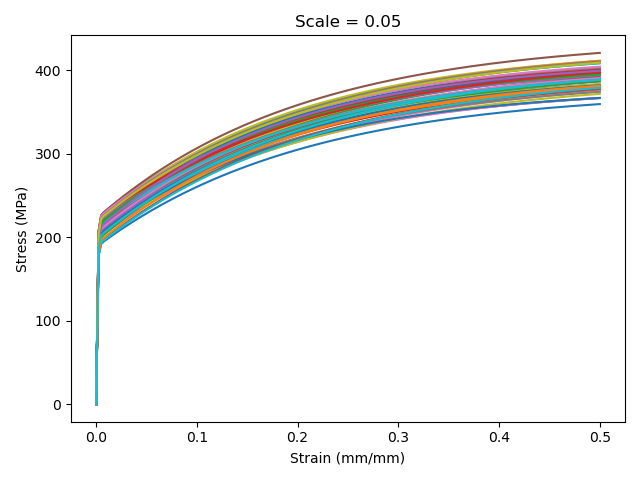
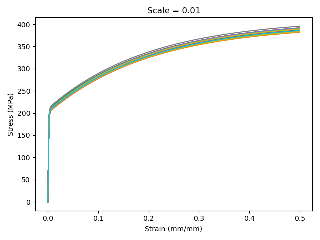
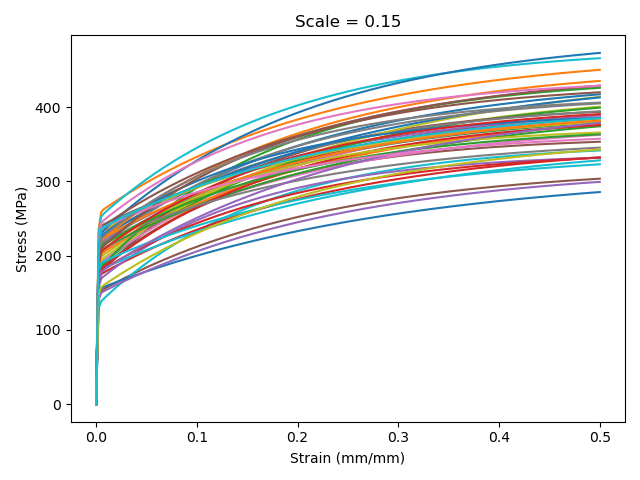
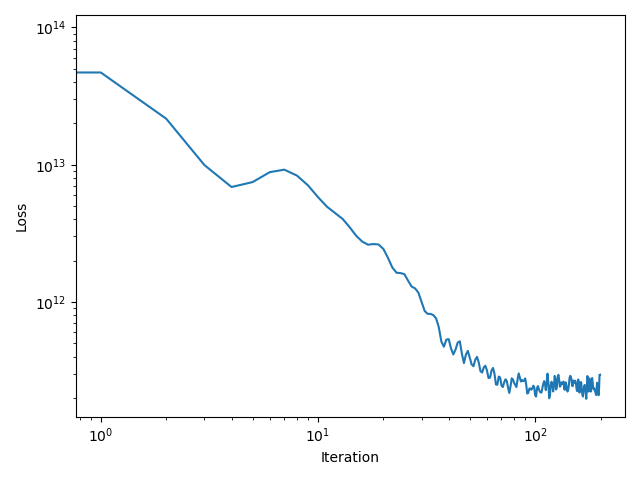

Structural material modeling tutorial
=====================================

The scripts for generating data and running the tutorial sample
problem can be found in the `examples/structural-inference/tension` directory
in the full distribution package.

The tutorial solves a practical problem: given experimental tension
test data for a material with varying material properties find a statistical
viscoplastic model, defined by a set of model parameter distributions, that
represents the resulting variation in the material response.  The experimental
data characterizes the variability in the material response.  This
variability may arise from heat-to-heat variation in the underlying
material properties, caused by manufacturing variability, or from random
experimental noise in the test controls and measurements.

There are three ingredients pyoptmat uses to generate a statistical model
for the material behavior

- Experimental data sampling different test conditions and the variability in the underlying material properties.
- A parameterized mathematical model describing the material behavior.  This model can be setup as as if it was deterministic, the inference process will find parameter distributions to explain the distribution of the test data.
- Guesses as to what the statistical distribution of each model parameter should be.  These are the formal prior parameter distributions for the statistical inference, and although they can be very poor guesses ("ill-informed priors") the inference algorithm can still produce a very accurate statistical model.

Input data
----------

The example works with synthetic experimental data.  These data represent
tension test results, given as stress/strain flow curves, at seven 
different strain rates: :math:`10^{-2}` 1/s, :math:`10^{-3}` 1/s,  
:math:`10^{-4}` 1/s, :math:`10^{-5}` 1/s, :math:`10^{-6}` 1/s, 
:math:`10^{-7}` 1/s, and :math:`10^{-8}` 1/s.  The material
has some variability in the material properties that determine the
experimental measurements.  So each repetition of a test at a particular
strain rate will produce a somewhat different flow curve.  To capture this
variability the test data includes 50 repeated tests at each strain rate,
for 350 tests data.  However, far fewer repeated tests are
actually needed to produce a
good statistical model of the material behavior.

   Plot showing the variation in the tensile flow curves for a 
   strain rate of :math:`10^{-2}` 1/s for a parameter scale of 0.05.

For this example the data is "synthetic."  That is, it is not actual
tests data but rather data generated through the material model, described
below, using known parameter distributions.  The goal here is to validate
the methods used by pyoptmat by recovering these known property distributions
through statistical inference over the synthetic data.

To test the reliability of pyoptmat for different amounts of material 
variability, the provided data includes five datasets, each with a
different level of material property variability.  The example generates
the synthetic data by simulating experiments using the model where
all the model parameters, except the Young's modulus, are sampled from
normal distributions with the parameters scaled so that the mean of each
distribution is 0.5.  The five datasets are then from
distributions with increasing variability, specifically the parameter
distributions have standard deviations of 0.0, 0.01, 0.05, 0.1, and 0.15.
Increasing variability in the parameter distributions translates to increased
scatter in the synthetic tension test data, representing, for example, 
materials with larger heat-to-heat variations caused by looser manufacturing
process controls.

   Plot showing the variation in the tensile flow curves for a 
   strain rate of :math:`10^{-2}` 1/s for a parameter scale of 0.01...

   ... compared the variation at the same strain rate for a scale of 
   0.15.

pyoptmat has the ability to infer the level of random noise in the
experimental data, separate from the statistical variation in the material
properties caused by heat-to-heat variation.  However, this synthetic dataset
does not include any noise, i.e. all the variation in the response is
caused by the distribution of the material properties.

The example directory contains pregenerated datasets for the aforementioned
five levels of material variability.  Therefore, in following this example 
you do not need to generate the synthetic test data. 
However, running the `examples/structural-inference/tension/maker.py` script (below)
will regenerate the test data, by simulating tension tests with model
parameters sampled from the assumed parameter distributions.

Mathematical model
------------------

This example uses a viscoplastic constitutive model with isotropic hardening 
to describe the material behavior.  Mathematically, this model is a 
system of two ordinary differential equations driving by the input
strain and time data from the experiments.  The first ODE in the
system describes the evolution of stress with time:

.. math::

   \dot{\sigma} = E \left(\dot{\varepsilon} - \dot{\varepsilon}_{vp} \right)

with

.. math::

   \dot{\varepsilon}_{vp} = \left\langle \frac{\sigma - \sigma_0 - K}{\eta} \right\rangle^{n}

In these expressions :math:`\dot{\varepsilon}` is the strain rate
driving material deformation, :math:`E` iss the material Youngs modulus,
:math:`\sigma` is the current stress, :math:`\sigma_0` is a threshold
stress, :math:`\eta` is the flow fluidity, :math:`n` is the
rate sensitivity, and :math:`K` is the isotropic hardening, defined below.  The
initial condition for this ODE is zero, i.e. the material starts in an 
unloaded state.

The second ODE describes the evolution of the isotropic hardening

.. math::

   \dot{K} = \delta \left(R - K \right) \left| \dot{\varepsilon}_{vp} \right|

where :math:`R` is the saturated isotropic hardening strength, :math:`\delta` 
describes how fast the hardening saturates, and the initial condition is 
again zero.

This model has 6 parameters: 
- :math:`E` the Young's modulus
- :math:`n` the rate sensitivity
- :math:`\eta` the flow fluidity
- :math:`\sigma_0` the threshold stress
- :math:`\delta` the isotropic hardening saturation parameter
- :math:`R` the saturated isotropic hardening

The model is parameterized so that the synthetic experimental data
is generated with distributions where all these parameter values are 0.5.
That is, 0.5 is the true mean of the parameter distribution for all the
parameters.  In actual materials there is comparatively little
heat-to-heat variation in the material Young's modulus :math:`E`.
Therefore, the analysis here treats the Young's modulus as deterministic
and fixed to a value of 0.5, both in generating the synthetic data and in
developing the statistical model.

This leaves five parameters.  The goal of the statistical inference is
to find distributions of these five parameters that explain the variation
in the experimental data.

pyoptmat can infer the amount of random noise in the test data, in addition
to inferring property distributions explaining the heat-to-heat variation
in the underlying material properties.  Models in pyopmat account for these random variations through Gaussian noise additively superimposed with the simulated
distribution of stress from the stochastic ODEs.  

In this example the data does not have any noise and so the model does not
infer the scale of this white noise term.  Instead the analysis fixes the
scale of the noise to a very small value (:math:`10^{-4}`), which is
essentially zero.

Statistical inference
---------------------

The script `examples/structural-inference/tension/statistics/infer.py`
(listed below) sets up the model and performs statistical variational
inference to find the model parameter distributions.  The script imports
two utility functions from `examples/structural-inference/tension/maker.py`
also used in generating the synthetic data.  The following walks through
`infer.py` and those two functions to explain how to load in experimental
data, setup a statistical model, provide prior distributions, and run
the interference.

Setup
"""""

The inference script relies on several other modules in pyoptmat, pyro, 
numpy, matplotlib, and xarray:

.. code-block:: python

   #!/usr/bin/env python3

   import sys
   import os.path
   sys.path.append('../../../..')
   sys.path.append('..')

   import numpy as np
   import numpy.random as ra

   import xarray as xr
   import torch

   from maker import make_model, downsample

   from pyoptmat import optimize, experiments
   from tqdm import tqdm

   import pyro
   from pyro.infer import SVI, Trace_ELBO
   import pyro.optim as optim

   import matplotlib.pyplot as plt

During inference, the parameter distributions might sample invalid or
difficult parts of the parameter space where integrating the model
becomes difficult.  Usually this does not affect the final results and
so the script suppresses the warnings pyoptmat provides when integration fails:

.. code-block:: python

   import warnings
   warnings.filterwarnings("ignore")

Accurately integrating models of this type requires using double precision arithmetic.

.. code-block:: python

   # Use doubles
   torch.set_default_tensor_type(torch.DoubleTensor) 

The next block of code sets up the problem to run on the GPU using CUDA, if
available, or falls back on the CPU if CUDA is not available.  torch will
use OpenMP to run in parallel in multiple cores on the CPU.  This behavior
may not be desirable, depending on your system setup, and can be suppressed by
setting `OMP_NUM_THREADS=1` in the system, for example as an environment
variable at the command line.

.. code-block:: python

   # Run on GPU!
   if torch.cuda.is_available():
       dev = "cuda:0"
   else:
       dev = "cpu"
   device = torch.device(dev)

The model maker function
""""""""""""""""""""""""

This is all the setup code.  The example relies on a "maker" function.
This function takes the model parameters as input and returns the initialize
pyoptmat model.  pyoptmat relies on these "maker" functions to abstract
the type of model -- deterministic or statistical.  Armed with this
maker function the package can either initialize the parameters as 
pytorch `Parameters` or pyro `samples` and reuse the same code for
both deterministic and statistical models.

The example uses two functions to define the final maker.  The first
function is in `maker.py`

.. code-block:: python

   def make_model(E, n, eta, s0, R, d, device = torch.device("cpu"), **kwargs):
     """
       Key function for the entire problem: given parameters generate the model
     """
     isotropic = hardening.VoceIsotropicHardeningModel(
         CP(R, scaling = optimize.bounded_scale_function((torch.tensor(R_true*(1-sf), device = device), torch.tensor(R_true*(1+sf), device = device)))),
         CP(d, scaling = optimize.bounded_scale_function((torch.tensor(d_true*(1-sf), device = device), torch.tensor(d_true*(1+sf), device = device))))) 
     kinematic = hardening.NoKinematicHardeningModel()
     flowrule = flowrules.IsoKinViscoplasticity(
         CP(n, scaling = optimize.bounded_scale_function((torch.tensor(n_true*(1-sf), device = device), torch.tensor(n_true*(1+sf), device = device)))),
         CP(eta, scaling = optimize.bounded_scale_function((torch.tensor(eta_true*(1-sf), device = device), torch.tensor(eta_true*(1+sf), device = device)))),
         CP(s0, scaling = optimize.bounded_scale_function((torch.tensor(s0_true*(1-sf), device = device), torch.tensor(s0_true*(1+sf), device = device)))),
         isotropic, kinematic)
     model = models.InelasticModel(CP(E, scaling = optimize.bounded_scale_function((torch.tensor(E_true*(1-sf), device = device), torch.tensor(E_true*(1+sf), device = device)))),
         flowrule)

     return models.ModelIntegrator(model, **kwargs)

This function constructs a fully-parameterized instantiation of the model, including the Young's modulus :math:`E`.  
The `kwargs` are used to place the model on the appropriate device (CPU and GPU) and any additional arguments are passed to
the model integrator.  This function mirrors the mathematical description above exactly.

Note that the :code:`CP` object is the :py:class:`pyoptmat.temperature.ConstantParameter` class imported from the
:py:mod:`pyoptmat.temperature` modules.  It means that the model parameters in this example do not depend on
temperature.

The `infer.py` script wraps this maker function with a small additional function:

.. code-block:: python

   # Don't try to optimize for the Young's modulus
   def make(n, eta, s0, R, d, **kwargs):
     return make_model(torch.tensor(0.5), n, eta, s0, R, d, 
         device = device, **kwargs).to(device)

which enforces the condition described above, that the Young's modulus is deterministic, fixed to the correct value (0.5),
and not included in the statistic inference.

With the maker function defined the main script loads "experimental" data, sets up prior distributions for the
parameters, and completes the inference for the parameter distributions.

Loading data
""""""""""""

The example problem loads 10 of the 50 repeated trials from the case with the known parameter scale of 0.05:

.. code-block:: python

  # 1) Load the data for the variance of interest,
  #    cut down to some number of samples, and flatten
  scale = 0.05
  nsamples = 10 # at each strain rate
  input_data = xr.open_dataset(os.path.join('..', "scale-%3.2f.nc" % scale))
  data, results, cycles, types, control = downsample(experiments.load_results(
      input_data, device = device),
      nsamples, input_data.nrates, input_data.nsamples)

By default the :py:func:`pyoptmat.experiments.load_results` function loads *all* of the experimental data in the 
xarray file.  The `downsample` function is defined in `maker.py` and reduces the dataset from the 50 full repeats at each 
strain rate down to the number requested, here 10.

.. code-block:: python

   def downsample(rawdata, nkeep, nrates, nsamples):
     """
       Return fewer than the whole number of samples for each strain rate
     """
     ntime = rawdata[0].shape[1]
     return tuple(data.reshape(data.shape[:-1] + (nrates, nsamples))[...,:nkeep].reshape(data.shape[:-1]+(-1,))
         for data in rawdata)

Prior distributions
"""""""""""""""""""

The next step is to provide some human readable names for the model parameters and then define the parameter prior distributions.

.. code-block:: python

  # 2) Setup names for each parameter and the priors
  names = ["n", "eta", "s0", "R", "d"]
  loc_loc_priors = [torch.tensor(ra.random(), device = device) for i in range(len(names))]
  loc_scale_priors = [torch.tensor(0.15, device = device) for i in range(len(names))]
  scale_scale_priors = [torch.tensor(0.15, device = device) for i in range(len(names))]

  eps = torch.tensor(1.0e-4, device = device)

  print("Initial parameter values:")
  print("\tloc loc\t\tloc scale\tscale scale")
  for n, llp, lsp, sp in zip(names, loc_loc_priors, loc_scale_priors, 
      scale_scale_priors):
    print("%s:\t%3.2f\t\t%3.2f\t\t%3.2f" % (n, llp, lsp, sp))
  print("")

The :code:`names` array is just an array of string names, one for each parameter in the order they
are passed to the maker function.  The next three lists define the prior distributions, one
for each parameter.  The statistical model put together here is a 
:py:class:`pyoptmat.optimize.HierarchicalStatisticalModel` with two levels of statistical
distributions.  At the bottom level the model first samples from random variables representing the
heat-specific model properties.  In the current implementation these distributions are
taken as normal distributions, meaning they are defined by a location parameter, giving the mean,
and a scale parameter, giving the standard deviation.  
This example assumes each test is drawn from a random heat (or, equivalently, each sample is from
a separate heat) and so once the model determines lower-level normal distribution for each parameter
it then samples those distributions once for each test, independently.

In the hierarchical model the heat-specific mean and standard deviation are themselves random variables. 
The mean of the heat-specific distributions is given itself by a normal distribution, again described by
the location and scale parameter.  The scale of the heat-specific distributions are given by half normal
distributions, parameterized by a scale parameter.

So three values define the statistical model for each parameter: the location and scale of the normal distribution
describing the heat-specific mean and the scale parameter defining the scale of the heat-specific mean.
The prior distributions can then be defined with initial guesses for each of these three parameters.  
The :code:`loc_loc_priors`, :code:`code_scale_priors`, and :code:`scale_scale_priors` define these priors for each 
model parameter.  In this example the locations (i.e. mean parameter values) are selected random from the range 
[0,1] (again recall the true mean parameter values used to generate the data are 0.5).  The scale parameters are all
set to 0.15 (recall the true scale in this example is 0.05).

These choices are generally good for models using real material data: the prior describing the location of each 
parameter distribution can be ill-informed and the scale of the priors should be set so that they produce
greater variance than in the actual test data.

The parameters in this example are scaled not only for convenience but for numerical reasons.  The "natural" model
parameters for the material model should be scaled so that they all have values of around 1.0.

As noted above, while pyopmat can infer the level of noise in the experimental data, this example does not
include any random error caused by experimental variability and so the scale of the white noise is fixed to a
small value (:math:`10^{-4}`).

Finally, the model prints out information on the prior values.  The location priors will vary, as they are random,
but the output will look something like this:

.. code-block:: console

   Initial parameter values:
        loc loc	        loc scale       scale scale
   n:	0.37		0.15		0.15
   eta:	0.52		0.15		0.15
   s0:	0.75		0.15		0.15
   R:	0.35		0.15		0.15
   d:	0.48		0.15		0.15

Setting up the model and optimizer
""""""""""""""""""""""""""""""""""

The next steps are to setup the 
:py:class:`pyoptmat.optimize.HierarchicalStatisticalModel` object,
initialize the guide distribution, and setup the optimizer used to
solve the problem.

.. code-block:: python

  # 3) Create the actual model
  model = optimize.HierarchicalStatisticalModel(make, names, loc_loc_priors,
      loc_scale_priors, scale_scale_priors, eps).to(device)

  # 4) Get the guide
  guide = model.make_guide()
  
  # 5) Setup the optimizer and loss
  lr = 1.0e-2
  g = 1.0
  niter = 200
  lrd = g**(1.0 / niter)
  num_samples = 1
  
  optimizer = optim.ClippedAdam({"lr": lr, 'lrd': lrd})

We generally suggest using a `ClippedAdam` optimizer.  The learning rate in
this example is too high for real experimental data.  We have found
learning rates around :math:`10^{-3}` work well for actual data.
The hyperparameters here configure geometric learning rate decay with
rate :code:`g`.  However, for this simple example this heuristic is not required
to produce good results.  For real data we have found :math:`g=0.9` or so
can help with convergence.

Statistical Variation Inference and running the problem
"""""""""""""""""""""""""""""""""""""""""""""""""""""""

We can now set up the pyro ELBO objective function and the SVI
problem and solve the inference problem.

.. code-block:: python

  ls = pyro.infer.Trace_ELBO(num_particles = num_samples)

  svi = SVI(model, guide, optimizer, loss = ls)

  # 6) Infer!
  t = tqdm(range(niter), total = niter, desc = "Loss:    ")
  loss_hist = []
  for i in t:
    loss = svi.step(data, cycles, types, control, results)
    loss_hist.append(loss)
    t.set_description("Loss %3.2e" % loss)

There :code:`num_samples` is the number of samples to use in calculating the
ELBO values.  We have not found increasing this from 1 to help with convergence.

The example will print a progress bar while it is determining the inferred distributions

.. code-block:: console

   Loss 3.02e+11:  42%|███████████▍               | 85/200 [11:40<15:52,  8.29s/it]

Results
"""""""

The script will print the inferred posterior distributions and plot the convergence
history

.. code-block:: python

  # 7) Print out results
  print("")
  print("Inferred distributions:")
  print("\tloc\t\tscale")
  for n in names:
    s = pyro.param(n + model.scale_suffix + model.param_suffix).data
    m = pyro.param(n + model.loc_suffix + model.param_suffix).data
    print("%s:\t%3.2f/0.50\t%3.2f/%3.2f" % (n,
      m,
      s,
      scale))
  print("")

  # 8) Plot convergence
  plt.figure()
  plt.loglog(loss_hist)
  plt.xlabel("Iteration")
  plt.ylabel("Loss")
  plt.tight_layout()
  plt.show()

The convergence history for this example is less smooth than for a better, smaller learning rate

   Convergence history for one run of the sample problem.  A smaller learning rate and more
   iterations would produce better convergence and, potentially, a more accurate model.

However, the final results are reasonable:

.. code-block:: console

   Inferred distributions:
         loc		scale
   n:	0.50/0.50	0.02/0.05
   eta:	0.49/0.50	0.02/0.05
   s0:	0.49/0.50	0.03/0.05
   R:	0.48/0.50	0.05/0.05
   d:	0.48/0.50	0.05/0.05

Because the priors are randomized your results will vary.  However, these results are fairy typical,
even for real data.  pyoptmat usually does a very good job establishing the mean of the parameter distributions
-- the results here are very close to the true mean of 0.5 -- and typically somewhat underestimates the
true variance, which is a problem common to most variational Bayes approaches.

Despite somewhat underestimating the true variance the model still does a very good job in
capturing the actual variation in the synthetic test data.

maker.py: script for regenerating the synthetic test data
---------------------------------------------------------

.. literalinclude:: /../../examples/structural-inference/tension/maker.py

infer.py: inferring the model parameter distributions
-----------------------------------------------------

.. literalinclude:: /../../examples/structural-inference/tension/statistical/infer.py

